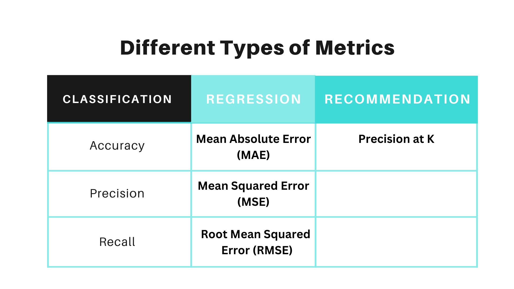
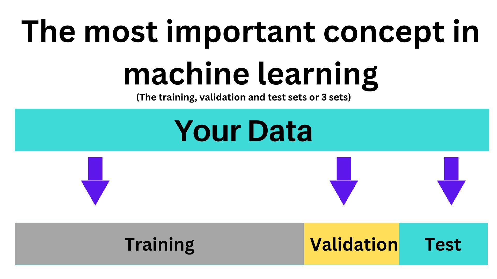

# Machine-Learning
Practcing all of my Machine learning skills

# 6 steps
## 1. Problme defination:

"what problem we are going to solve 

## 2. Data:

Data is requirement for any Machine Learning project. what kind of data you have? Depending on the problem, there are different kinds of data such as rows and columns 

* Structured data: Such as rows and columns, or waht you'd expect to find in an Excel spreadsheet
* Unstructured data such as images and audio
- Once we know what kind of data we have, we can start to make decisions on how to use machine learning with it 

## 3. Evaluation:

Here "What defines success for us?"
* Since Machine learning is actually experimental. You can keep going forever trying to improve your results in search of the perfect model.

* As a practitioners, we know the prefect model doesn't exist. We began by saying, for the machine learning real estate project to be feafible, we need atlest a 95% accurate model at predicting the cost of houses.

## 4. Features

What do we already know about the data? 

* For example: for predicting whether or not someone has heart disease, you might use their body weight as a featureSince body weight is a number, it's called a numerical feature.

* After talking to a doctor, they might tell you if someone's body weight is over a certain number, they're more likely to have heart disease.

* They are more kinds of features, such as categorical and derived.

## 5. Modeling:

Once you've learned a little bit about your data, the next step is to model it.
"Based on our problem and data, what model should we use?"

* Unlike other algorithms and sets of instructions, you have to write from scratch, Many algorithms are already coded for you, which is beautiful for us.

* Some models work better on different problems than others, and in the beginning, your focus will be to figure out the right model for the right kind of problem.

## 6. Experimentation:

"How could we improve/what can we try next?"

All of the steps we've just been through happen in a cycle. How might start out with one problem definition and find your data isn't suited to it? Then you might build a model and find out it doesn't work as well as you outlined in your evaluation metric.

_____________________________________________________________________________________

# Types of MACHINE LEARNING problem:

### 1. Problem Definition: "What problem we trying to solve?"

Supervised Learning 
Unsupervised Learning 
Transfer Learning 
Reinforcement Learning 

### **Supervised Learning:** 

Supervised learning is called supervised learning because you have data and labels. A machine learning algorithm tries to use the data to predict a label. If it guesses the label wrong, the algorithm corrects itself and tries again. This act of correction is why it's called `supervised`. It's like if you were trying to guess the steps it took to turn a set of ingredients, the data into your favorite soup dish, the label. If you tried once and got it wrong, you tell yourself this was wrong. Maybe next time we'll try something different.

_A supervised learing algorithm repeats this process over and over and over again, trying to get better._

* The main types of `supervised learning` problems are classification and regression: 
**Binary Classification:** Two Options. _the person have heart disease: yes or no_
**Multi-class classification:** The options more than two. Weather prediction: `cloudy, sunny, rainy`
**Regression**: Regression problems involve trying to predict a number. `House predictions`, `stock prices`

### **Unsupervised Learning:**

Unsipervised learning has data but no labels. `Unsupervised learning` is when it can provide a set of unlabelled data, which it is required to analyze and find patterns inside. The examples are dimension reduction and clustering.

### **Transfer Learning:**

Transfer learning leverages what one machine learning model has learned in another machine learning.For `example` say, you're trying to predict what dog breed appears in a photol. You can find an existing model which is learned to decipher different car type and fine tune it for your task.

**Why it is valuable?** Because training a machine learning algorithm, which means letting it find all of the of the patterns in data, can be very expensive tak to find patterns in data. A `Machine Learning` algorithm has to make millions of calculatoins. So instead of learning everything about different photos from scratch, such as what patterns look like.

### **Reinforcement Learning:**

Some more examples of `reinforcement learning` in image processing include: Robots equipped with visual sensors from to learn their surrounding environment. Scanners to understand and interpret text. Image pre-processing and segmentation of medical images, like CT Scans.

** So match your problem

_____________________________________________________________________________________

# Types of data: "What kind of data do we have"

Data comes in many different shapes and sizes, but the main two types are structured and unstructured.

**Structured data:** Structured data is something you'd expect to see in `excel file`, such as rows and columns of different patient records and whether or not they have heart disease or customer purchase transactions. It's called structure data because all of the samples, the different patient records, are typically in similar format, meaning one column might contain numebers of a certain type, such as average blood pressure or sex of weight of a patient.

**Unstructured Data:** are things like images, natural language, text such as transcribed phone calls, videos and audio files. Although we can turn these files into numbers and create structure, they typically come in many varying formats.

`The more data the better.`
_____________________________________________________________________________________

# Types of Evaluation: "What defines success for us?"

Every `Machine Learning` problem you come across will have the similar goal of finding insights in data to preditct the future in some way. And `Evaluation Metric` is a measure of how well a machine learning algorithm predicts the future. And in this step, the question yout want to answer is _What defines success for us?_

**Project: Heart Disease** for this project to be worth pursuing further, we need a machine learning model with over `99%` accuray. Because predicting whetheror not a patient has heart disease is an important task. _so you want highly accurate model._

**There are different evaluation metrics for different problems for classification**

**Accuracy:** For regression or predicting a number such as how much a car well sell for, you'll probably want to minimzie how different the number your model predicts to the actual sale price. For this `Mean Absolute Error` & `Mean Square Error` are common options or for recommendation problems.

You may have thousands of different products to recommend to someone, but in reality you only care about the top ten recommendations and how well they align to a customer's potential interest. To measure this, you could use precision at K, where in out case K is `10`.

**Precision:**

**Recall:**

_____________________________________________________________________________________

# Modelling Part 1-3 sets: "Based on out problem and data, what model should we use?"

1. Choosing and training a model
2. Tuning a model
3. Model Comparison

**The most important concept in machine learning:** The training, validation and test sets. Now, since you want to be using machine leanring models to gain insights data to predict the future, it's important to test how well they would go and do in the real world. To this, you split your data into these three different sets `[training, validation and test sets]`.
* Training Set: To train your model
* Validation Set: To churn your model
* Test Set: Compare your different models

---------------------------------------------------------------------------------------

### Measugin Distances:

**Defination And Properties:**

* Distance measures play an important role in machine learning.

They provide the foundation for many popular and effective machine learning algorithms like k-nearest neighbors for supervised learning and k-means clustering for unsupervised learning.

Different distance measures must be chosen and used depending on the types of the data. As such, it is important to know how to implement and calculate a range of different popular distance measures and the intuitions for the resulting scores.

**Role of Distance Measures:**

Distance measures play an important role in machine learning.
